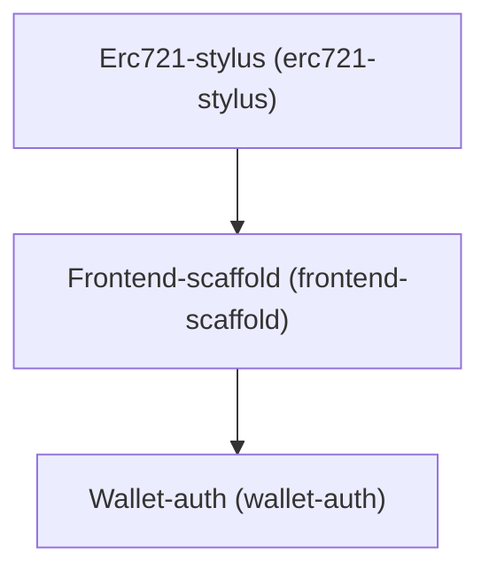

# Architecture

## Dependency Graph

```mermaid
graph TD
  264a8cb0["Erc721-stylus (erc721-stylus)"]
  cf0edd37["Frontend-scaffold (frontend-scaffold)"]
  9b5db22e["Wallet-auth (wallet-auth)"]
  264a8cb0 --> cf0edd37
  cf0edd37 --> 9b5db22e
```

## Execution / Implementation Order

1. **Erc721-stylus** (`264a8cb0`)
2. **Frontend-scaffold** (`cf0edd37`)
3. **Wallet-auth** (`9b5db22e`)
